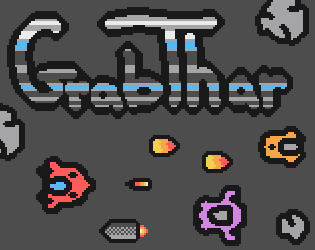

### Grabthar! Defeat your enemies, and steal their weapons if they defeat you! Can you make it back home to earth?

Your current weapon is shown in the top right corner, and your current score and ship count are shown in the top left corner.

### Controls
- Left, Right, Up, Down or ASDF: Move your ship
- Space, Z: Fire your current weapon 

When you are killed by an enemy ship, their weapon replaces your current weapon. Great if they had a nice weapon... not so much if they had a worse one. If you are killed by a space rock, you are back to your base weapon. Is it better to upgrade early on to take out harder enemies, or wait to have more lives to take on the harder enemies and get their weapons? Who knows!

### Notes

If you look through the code, there's hints at other powerups and weapons, but I ran out of time. I might continue with this after the jam, because Kaplay has been fun to work with! Everything created by me, except for the font, and "Grabthar" is from Galaxy Quest, though I didn't remember that when I first though of it. The drums in the music are from Star Power Drummer. All sounds/music from my ukulele haha

This was an entry to the [2024 KAJAM](https://itch.io/jam/kajam): [Itch.io page](https://cobrajs.itch.io/grabthar)
